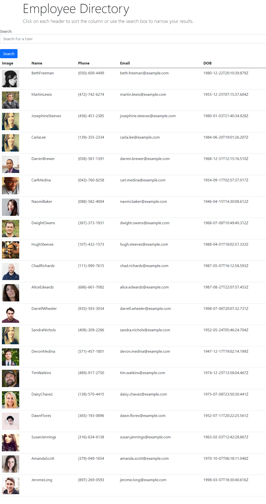

# Employee Directory
This applicatiion allows a user to view imported employee information and will allow data to be sorted and searched upon. 

## Motivation
My motivation for this project was to put my knowledge of React to use.  I created a site that allows users to view employee data and manipulate the data as they need.   

### Repository

View my [GitHub_Repository](https://github.com/joshwalters34/React-Employee-Directory)

### Website

Visit my [Website](https://joshwalters34.github.io/React-Employee-Directory/)

### Images

### Technologies 
- React
- Javascript
- Axios
- API
- lodash
- React-dom

### Installation
To install dependencies for this application, run the following commands

        npm init -y
        npm i